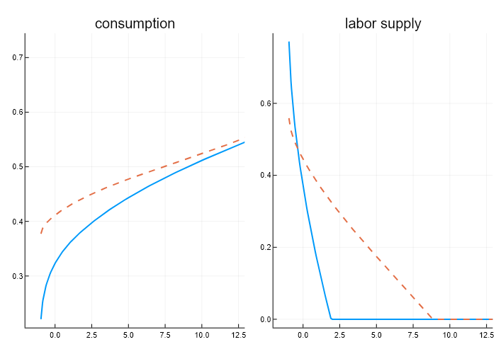
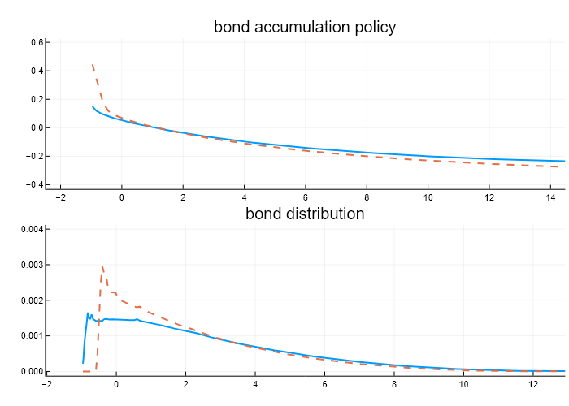
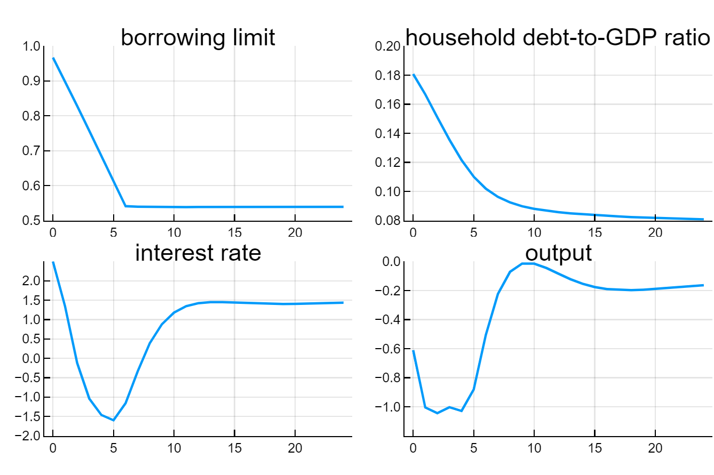

# GL2017Replication

## About The Project

This replication study replicates parts of the paper `Credit crises, precautionary savings, and the liquidity trap` (Guerrieri, Lorenzoni (2017)). The code notation mostly follows the original version of the authors in MATLAB.
 
## Table of Contents
 
  - [Get Started](#get-started)
  - [Solving the Model](#solving-the-model)
  - [Calibrating the Steady-State](#calibrating-the-steady-state)
    - [Initial Steady-State](#initial-steady-state)
    - [Terminal Steady-State](#terminal-steady-state)
  - [Results](#results)
    - [Policies in Steady-State (initial)](#policies-in-steady-state-initial)
    - [Steady-State Comparison](#steady-state-comparison)
  - [Transition Dynamics](#transition-dynamics)
  - [References](#references)

## Get Started

To get started, clone the repository to your local machine. Start Julia and navigate to the \src folder, press `]` to enter the package manager and type `activate .` to activate the package environment. You should now see the new package prompt. Type `instantiate` to resolve all package dependencies. Include the GL2017Replication.jl package file into your script and import the package:
```
include("GL2017Replication.jl")
using .GL2017Replication
```
(Alternatively you can install the package to your dev folder in you Julia installation, see the Julia documentation for details). The file main.jl in the \src folder contains an example work flow to solve the model.

## Solving the Model

An easy way to solve the model in steady-state with the given set of default parameters is shown below. Note that all the steps have to occur sequentially.
First, instantiate the ModelGL structure that holds all parameter values and solutions of the model.
```
gl = ModelGL() 
```
Calling 
```
compute_steady_state!(gl)
``` 
will solve for the steady-state policy function, joint distribution over productivity and asset states as well as aggregate variables.
 

## Calibrating the Steady-State 

### Initial Steady-State

To calibrate the model in steady-state to a given set of target values do the following:
First, instantiate the ModelGL structure as above.
```
gl = ModelGL() 
```
Calling the calibrate function will solve the model many times and calibrate the parameters to the target values:
```
calibrate!(gl)
```
The solution and the calibrated parameters will be stored in the ModelGL structure.

### Terminal Steady-State

To calibrate the model to the terminal steady-state we first need a calibrated model for the initial steady-state (step above):
```
gl = ModelGL()  
calibrate!(gl)
``` 
Given the solved initial steady-state we can calibrate the terminal steady-state to the new debt-target
```
gl_tss = calibrate_terminal(gl)
``` 
where `gl_tss` denotes the terminal steady-state object.

## Results
At any point we can query basic statistics (parameter values, aggregates and targets) with the describe function
```
describe(gl)
``` 
or
```
describe(gl,gl_tss)
``` 
for a side-by-side comparison of the initial and terminal steady-state.

### Policies in Steady-State (initial)
Figure I in the paper.
<p float="left">
   
</p> 

### Steady-State Comparison
Figure IV in the paper.
<p float="left"> 
  
</p> 


## Transition Dynamics
:information_source: Preliminary: Does not coincide with paper result.

This part is of particular interest. When we tried to replicate Figure 3 of the original paper without loading the transition objects previously obtained by the authors (i.e., we set `rerun` different from 1), but keeping the default values of `speed = 0.5` and `decay = 0.3` (two parameters governing the updating rule of ), we couldn't make the code converge. Potentially the authors used two different parameters that are a priori impossible to deduce. Importantly, for the combination of `speed` and `decay` that we use (i.e., 0.1 and 0.01) we reach a convergence up to a tolerance of `~0.0025` (after 400 iterations). Using the same numerical parameters in the original MATLAB code we obtain essentially the same evolution for all variables included in Figure 3 (trivially, the borrowing constraint, but also household debt, the interest rate, and aggregate output). This somehow reassures us about the validity of our approach, although we cannot obviously rule out completely the possibility that we missed some other features of the code explaining the puzzle. 
Below, we show our reproduction of Figure 3 in the original paper.

<p float="left"> 
  
</p> 

## References 
Guerrieri, V. & Lorenzoni, G.
Credit crises, precautionary savings, and the liquidity trap 
The Quarterly Journal of Economics, Oxford University Press, 2017, 132, 1427-1467