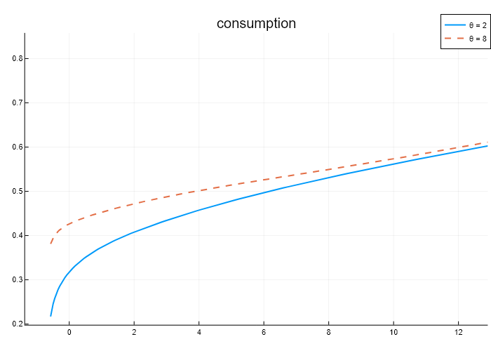
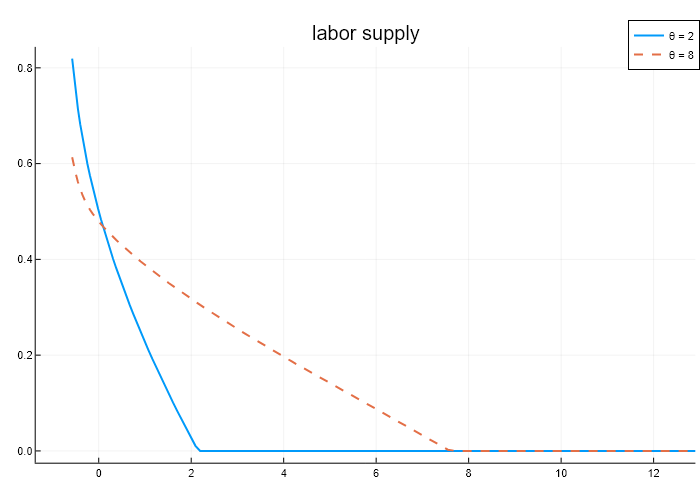
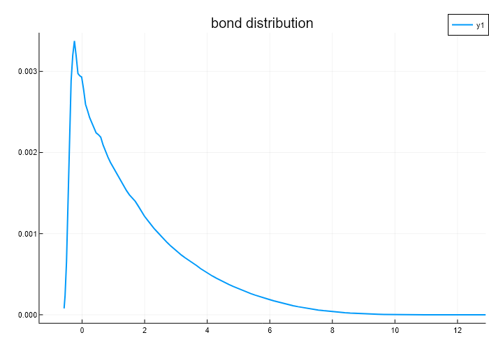

# GL2017Replication


 - [GL2017Replication](#gl2017replication)
  - [About The Project](#about-the-project)
  - [Solving the Model](#solving-the-model)
  - [Calibrating the Steady-State (initial)](#calibrating-the-steady-state-initial)
  - [Calibrating the Steady-State (terminal)](#calibrating-the-steady-state-terminal)
  - [Results](#results)
    - [Policies in Steady-State (initial)](#policies-in-steady-state-initial)
    - [Distribution in Steady-State (initial)](#distribution-in-steady-state-initial)
  - [Transition Dynamics](#transition-dynamics)
  - [References](#references)
  
## About The Project

This replication study replicates parts of the paper `Credit crises, precautionary savings, and the liquidity trap` (Guerrieri, Lorenzoni (2017)). The code notation mostly follows the original version of the authors in MATLAB.

## Solving the Model

An easy way to solve the model in steady-state with the given set of default parameters is shown below. Note that all the steps have to occur sequentially.
First, instantiate the ModelGL structure that holds all parameter values and solutions of the model.
```
gl = ModelGL() 
```
Calling 
```
compute_steady_state!(gl)
``` 
will solve for the steady-state policy function, joint distribution over productivity and asset states as well as aggregate variables.
 

## Calibrating the Steady-State (initial)

To calibrate the model in steady-state to a given set of target values do the following:
First, instantiate the ModelGL structure as above.
```
gl = ModelGL() 
```
Calling the calibrate function will solve the model many times and calibrate the parameters to the target values:
```
calibrate!(gl)
```
The solution and the calibrated parameters will be stored in the ModelGL structure.

## Calibrating the Steady-State (terminal)

To calibrate the model to the terminal steady-state we first need a solved initial steady-state (as above): Either solve the initial steady-state for the default parameters by calling  
```
gl = ModelGL()  
compute_steady_state!(gl)
``` 
or calibrate the initial steady-state to the target values 
```
gl = ModelGL()  
calibrate!(gl)
``` 
Given the solved initial steady-state we can calibrate the terminal steady-state to the new debt-target
```
gl_tss = calibrate_terminal(gl)
``` 
where `gl_tss` denotes the terminal steady-state object.

## Results

### Policies in Steady-State (initial)

<p float="left">
  
    
</p> 

### Distribution in Steady-State (initial)

<p float="left"> 
  
</p> 


## Transition Dynamics

## References 
Guerrieri, V. & Lorenzoni, G.
Credit crises, precautionary savings, and the liquidity trap 
The Quarterly Journal of Economics, Oxford University Press, 2017, 132, 1427-1467